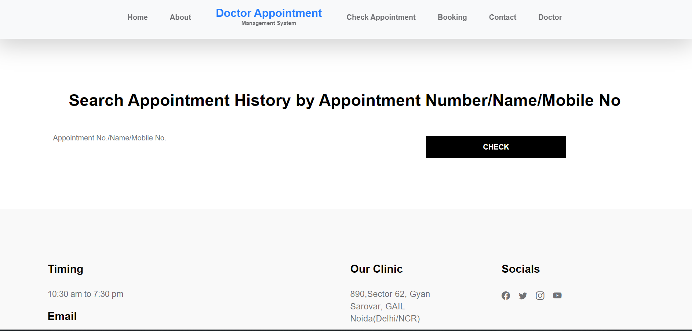
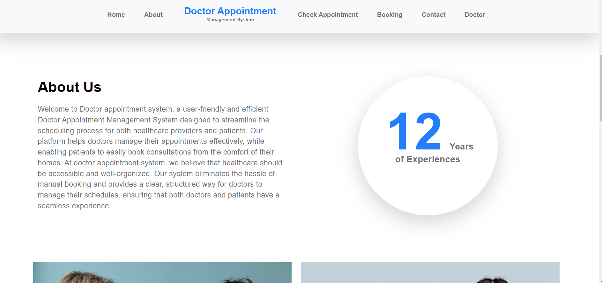
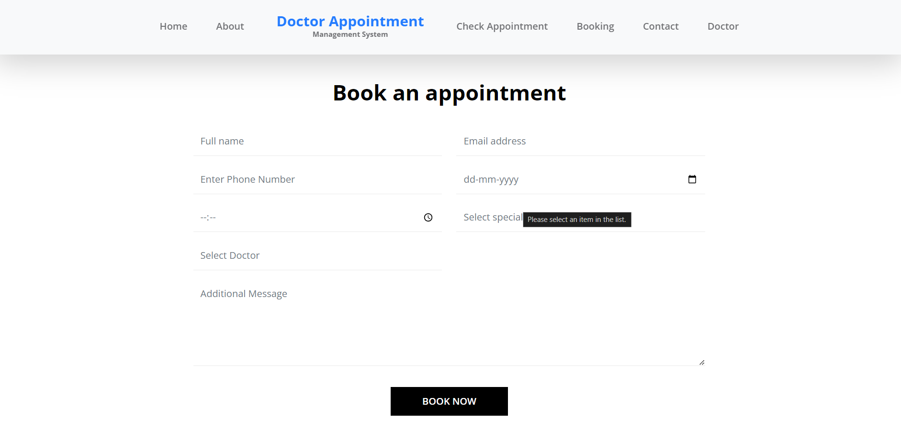
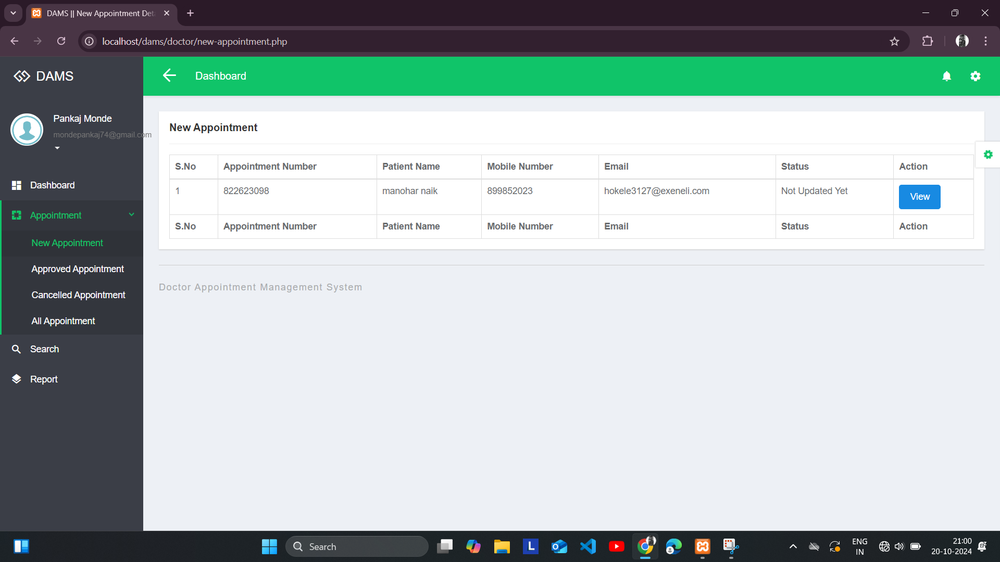
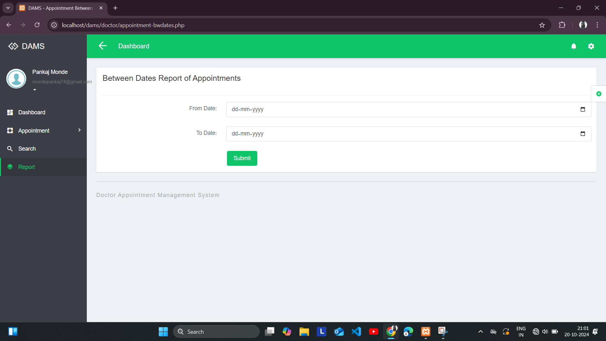

# 🩺 Doctor Appointment Management System

A full-stack web-based appointment booking system developed using PHP and MySQL. This system enables patients to book doctor appointments without registration while allowing doctors to manage and update appointment records.

---

## 📌 Project Overview

The Doctor Appointment Management System streamlines the appointment process for clinics and hospitals. Patients can easily book appointments, and doctors can manage appointments through their dashboard. The system supports real-time interactions, appointment status updates, and a secure backend using PHP PDO.

---

## 🧑‍💻 Tech Stack

| Layer        | Technologies Used                     |
|--------------|----------------------------------------|
| Front-End    | HTML, CSS, JavaScript, jQuery          |
| Back-End     | PHP (with PDO)                         |
| Database     | MySQL                                  |
| Dynamic Load | AJAX                                   |
| Deployment   | Localhost using XAMPP                  |

---

## 🧩 Project Modules

### 👨‍⚕️ Doctor Module

1. **Dashboard** – View total new, approved, and canceled appointments  
2. **Appointment Management** – View, manage, and change status of appointments  
3. **Reports** – Generate appointment reports by date  
4. **Search** – Search by appointment number, patient name, or mobile number  
5. **Settings** – Update profile, change password, recover password

---

### 👤 User Module (No Registration Required)

1. **Home Page** – View welcome page and intro  
2. **Book Appointment** – Submit appointment request without logging in  
3. **Check Appointment** – Search appointment by number, name, or mobile number

---

## ⚙️ How to Run Locally

Follow the steps to set up and run the project on your system:

1. **Download** the ZIP file and extract it
2. **Copy** the `dams` folder
3. **Paste** it into your server’s root directory:
   - For XAMPP → `C:/xampp/htdocs/`
   - For WAMP → `C:/wamp/www/`
   - For LAMP → `/var/www/html/`
4. Open [http://localhost/phpmyadmin](http://localhost/phpmyadmin)
5. **Create a new database** named: `damsmsdb`
6. **Import** the file `damsmsdb.sql` (found inside the SQL folder)
7. Run the project at: (http://localhost/dams)

---

You can also register a new doctor from the login page.

---

## 🖼️ Screenshots

---

